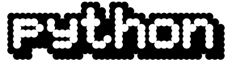
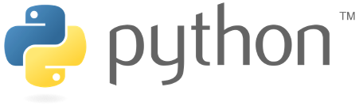

# Krótko o języku Python
Python - język programowania wysokiego poziomu ogólnego przeznaczenia. 
Jego najważniejsze cechy:
- Posiada rozbudowany pakiet bibliotek standardowych
- Ideą przewodnią jest przejrzystość, czytelność i zwięzłość kodu
- Wspiera różne paradygmaty: obiektowy (programy definiuje się za pomocą obiektów - elementów łączących stan i zachowanie), imperatywny (proces wykonywania jako sekwencja instrukcji zmieniających stan programu), funkcyjny (funkcje należą do wartości podstawowych, a nacisk kładzie się na wartościowanie (często rekurencyjnych) funkcji, a nie na wykonywanie poleceń)
- Posiada w pełni dynamiczny system typów i automatyczne zarządzanie pamięcią
- Używany jako język skryptowy - interpretery Pythona są dostępne dla wielu systemów operacyjnych.
- Rozwijany jako projekt Open Source, zarządzany przez Python Software Foundation (organizacja non-profit)

# Historia Pythona
- Powstał we wczesnych latach 90-tych, jego twórcą jest Guido van Rossum
- Miał być następcą języka ABC
- Nazwa nie pochodzi od węży, ale od serialu komediowego - Latający cyrk Monty Pythona
- W 2000 roku została wydana wersja 2.0. Od wersji 2.1 jest w całości wydawany przez Python Software Foundation - PSF (do której należy cała własność intelektualna), która jest wzorowana na organizacji Apache Software Foundation. 
- W 2008 roku została wydana wersja 3.0. Od 2020 roku jest jedyną wspieraną i stale rozwijaną oficjalną wersją języka.

Guido van Rossum

Logo języka z lat 1990-2006

Logo języka od roku 2006

# Najważniejsze zastosowania języka Python
- Aplikacje sieciowe i Internetowe (Frameworki takie jak Django, Pyramid, Micro-frameworki takie jak Flask czy Bottle, Zaawansowane CMSy takie jak Plone oraz django CMS). Standardowe biblioteki Pythona wpierają wiele protokołów komunikacji Internetowej (HTML i XML, JSON, przetwarzanie e-mail, FTP, IMAP, interfejsy gniazdowe). Biblioteki dodatkowe dostarczają wielu więcej możliwości (Request - potężna biblioteka klienta HTTP, Beautiful Soup - parser HTML, Feedparser - parsowanie RSS/Atom, Paramiko - implementuje protokół SSH2, Twisted Python - framework służący asynchronicznemu programowaniu sieciowemu)
- Obliczenia naukowe i numeryczne (SciPy - zestaw pakietów dedykowany zastosowaniom matematycznym, naukowym i inżynierskim, Pandas - biblioteka dedykowana analizie danych i modelowaniu statystycznemu, IPython - potężna, interaktywna powłoka wspierająca wizualizowanie danych)
- Edukacja (dostępność wielu interesujących opracowań wprowadzających w zagadnienia informatyki)
- Aplikacje desktopowe z graficznym interfejsem użytkownika (GUI) (dostępność takich bibliotek umożliwiających projektowanie i programowanie interfejsu użytkownika jak Tk, wxWidgets, Kivy, Qt przez pyqt lub pyside, GTK+, Microsoft Foundation Classes przez rozszerzenia win32)
- Rozwój i testowanie oprogramowania (Python jest często wykorzystywany jako narzędzie wspierające proces rozwoju oprogramowania. Szczególnie interesujące narzędzia do biblioteki SCons, Buildbot, Apache Gump, Roundup, Trac)
- Aplikacje biznesowe (Python znajduje zastosowanie w rozwijaniu aplikacji typu ERP oraz systemach e-commerce - platformy Odoo i Tryton)

# Powody do nauki języka Python (TOP 10)

1. Python jest obecnie najpopularniejszym językiem programowania (index TIOBE 2021). Programy napisane z języku Python działają na większości wykorzystywanych obecnie platform (Java, .NET, Android, iOS) i w większości wykorzystywanych systemów (Unix, Linux, Windows, Mac OS) 
2. Python jest stosunkowo prosty. 

Przykład - program "Hello World!" w języku C++ i Python 
C++:
<pre>
#include <iostream>

int main() { 
    std::cout << "Hello World!"; 
    return 0; 
}
</pre>
Python: 
<pre>
print("Hello World!")
</pre>
3. Jest szybki w instalacji, konfiguracji i nauce
4. Jest wydajny - również do zastosowań w BigData (przetwarzanie ogromnych zbiorów danych)
5. Znajomość i umiejętność programowania w Pythonie jest dobrze wynagradzana na rynku pracy (średnie wynagrodzenie w 2017 w U.S. dla programistów Python - 116 027 $ rocznie)
6. Rozwój technologii sieciowych oraz przetwarzania Big Data powoduje rosnące zapotrzebowanie na programistów języka Python
7. Możliwości zastosowań (programowanie układów mikroprocesorowych - Arduino, Raspberry Pi, Cybersecurity, IoT, Marketing, badania naukowe, obróbka danych, statystyka, uczenie maszynowe i AI, testowanie oprogramowania, Web development - Django/Flask )
8. Jest uważany za język "potężny" - mimo prostoty można z nim wiele zrobić. Jest używany w swoich aplikacjach przez takie firmy jak Google, Dropbox, Spotify czy Netflix.
9. Posiada wiele rozszerzeń - modułów i bibliotek, które przyspieszają tworzenie kodu. Przykłady: tworzenie GUI (PyQT, PySide, PyGTK), obliczenia matematyczne (Numpy, Scipy, matplotlib), tworzenie aplikacji sieciowych (Django, Flask), uczenie maszynowe (scikit-learn), tworzenie gier (PyGame)
10.	Posiada dużą i sprawną społeczność oraz bogactwo materiałów do nauki (w tym dokumentacja i tutoriale). 

# Najważniejsze dystrybucje i środowiska

### Dystrybucje:
- Oficjalna dystrybucja - https://www.python.org
- Continuum Anaconda - https://www.anaconda.com/products/individual

### Środowiska i edytory:
- Idle - https://docs.python.org/3/library/idle.html
- Mu - https://codewith.mu
- Spyder - https://www.spyder-ide.org
- Jupyter - https://jupyter.org
- VS Code - https://code.visualstudio.com
- PyCharm - https://www.jetbrains.com/pycharm/

### Interpretery sieciowe:
- ReplIT - https://replit.com
- Google Colab - https://colab.research.google.com

# Literatura

Netografia:
- https://pl.wikipedia.org/wiki/Python
- https://en.wikipedia.org/wiki/History_of_Python
- https://en.wikipedia.org/wiki/Python_(programming_language)
- https://pl.wikipedia.org/wiki/Programowanie_obiektowe
- https://pl.wikipedia.org/wiki/Programowanie_funkcyjne
- https://pl.wikipedia.org/wiki/Programowanie_imperatywne
- https://pl.wikipedia.org/wiki/Interpreter_(program_komputerowy)
- https://pl.wikipedia.org/wiki/Kompilator
- https://www.python.org/about/apps/
- https://www.geeksforgeeks.org/polymorphism-in-python/

### Licencja:

- Teksty i ilustracje niniejszych materiałów są objęte licencją CC BY-NC-ND 4.0: https://creativecommons.org/licenses/by-nc-nd/4.0/deed.pl
- Kody źródłowe zawarte w niniejszych materiałach są objęte licencją MIT: https://opensource.org/licenses/mit-license.php
